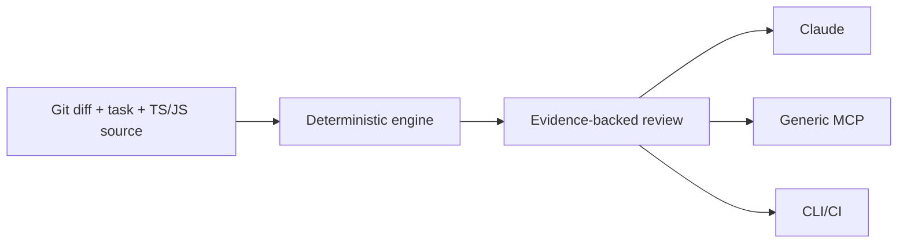

# Frankly

#### Your AI writes code. Frankly reviews it, frankly.

<div align="center">

[](https://github.com/amrishkhan05/frankly/stargazers)
[](LICENSE)
[](https://www.npmjs.com/package/@amrishkhan05/frankly)

</div>

---

## What is Frankly?

Frankly is a **local‑first change‑intelligence engine** for coding agents. It inspects the current Git diff and your TypeScript/JavaScript project, then asks whether **every changed file and symbol earned its place**. No hidden LLM calls, no cloud dependencies – everything runs deterministically on your machine.

---

## Table of contents

- [Quick start](#quick-start)
- [The ten-second demo](#the-ten-second-demo)
- [Claude Code plugin](#claude-code-plugin)
- [Generic MCP](#generic-mcp)
- [GitHub Copilot](#github-copilot)
- [CLI reference](#cli-reference)
- [MCP tool reference](#mcp-tool-reference)
- [Configuration](#configuration)
- [Privacy and security](#privacy-and-security)
- [Contributing](#contributing)

---

## Quick start

```bash
# Clone the repo
git clone https://github.com/amrishkhan05/frankly.git
cd frankly

# Install dependencies (Node.js 20+ required)
npm install

# Run the test suite
npm test

# Build the project
npm run build
```

Install the published package with `npm install @amrishkhan05/frankly`.

---

## The ten-second demo

```text
Task: Retry HTTP 429 responses

FRANKLY · RED INK REVIEW
{{ ... }}

CORRECTION PASS (1/1)
Preserve behavior and safety; remove or justify the red marks, then verify once.
```

## Claude Code plugin

Frankly's public GitHub repository is also its Claude Code marketplace. Use the following commands:

| Command | Description |
|---|---|
| `claude plugin marketplace add amrishkhan05/frankly` | Add Frankly to the Claude marketplace |
| `claude plugin install frankly@frankly` | Install the Frankly plugin |


The marketplace catalog is [`.claude-plugin/marketplace.json`](.claude-plugin/marketplace.json). It installs the plugin from this repository root (`"source": "./"`), which contains its manifest, MCP configuration, hooks, and skills. The plugin's explicit version is `0.1.0`; users receive future marketplace updates when that version changes.

After an update, refresh the marketplace and plugin:

| Command | Description |
|---|---|
| `claude plugin marketplace update frankly` | Update marketplace entry |
| `claude plugin update frankly@frankly` | Update installed plugin |


For local development, validate and install the checkout as a marketplace:

| Command | Description |
|---|---|
| `claude plugin validate .` | Validate plugin locally |
| `claude plugin marketplace add ./` | Add current directory to marketplace |
| `claude plugin install frankly@frankly` | Install the plugin |


Run `/reload-plugins` when Claude Code asks for activation after installation or an update. `claude plugin list` shows the installed plugin and version.

For a one-session local checkout without marketplace installation:

| Command | Description |
|---|---|
| `claude --plugin-dir /absolute/path/to/frankly` | Run Claude with the Frankly plugin directory |


The plugin bundles Frankly's MCP server and a `Stop` hook. At task completion it runs a Red Ink Review; when correction is warranted it returns exactly one constrained correction request. The second stop is allowed, preventing loops. Claude Code's current plugin layout and hook behavior are documented in the [official plugin reference](https://code.claude.com/docs/en/plugins-reference) and [hooks reference](https://code.claude.com/docs/en/hooks).

The first plugin run installs the package's declared runtime dependencies into Claude's plugin data directory. Repository analysis remains local and makes no external requests.

## Generic MCP

After building, start the stdio server with:

```bash
node /absolute/path/to/frankly/dist/integrations/mcp/index.js
```

Use that command anywhere an MCP client accepts a local stdio server.

### Codex

```bash
codex mcp add frankly -- node /absolute/path/to/frankly/dist/integrations/mcp/index.js
```

Codex stores MCP settings in `~/.codex/config.toml` or trusted project `.codex/config.toml`, and its CLI, IDE extension, and desktop app share the configuration. See the [official OpenAI MCP documentation](https://developers.openai.com/codex/mcp).

Codex does not expose Claude's Stop-hook lifecycle. Use the four MCP tools at plan, review, correction, and verification checkpoints.

### Cursor

Create `.cursor/mcp.json`:

```json
{
  "mcpServers": {
    "frankly": {
      "command": "node",
      "args": ["/absolute/path/to/frankly/dist/integrations/mcp/index.js"]
    }
  }
}
```

Cursor's [current MCP documentation](https://docs.cursor.com/context/model-context-protocol) confirms project configuration at `.cursor/mcp.json`. Automatic lifecycle hooks are not assumed; invoke Frankly's tools from Agent mode.

### GitHub Copilot

Frankly includes a native Copilot plugin with `/frankly`, `/frankly-plan`, `/frankly-review`, `/frankly-verify`, and `/frankly-help` commands. Its manifest is at `.github/plugin/plugin.json`, with a marketplace descriptor at `.github/plugin/marketplace.json`.

For local development, build this checkout and install the repository directory with VS Code's Copilot plugin flow. The plugin registers a session-start instruction, its Frankly skill, and the slash commands. Reopen VS Code after installing or updating the plugin.

```bash
npm install
npm run build
```

This repository also includes `.vscode/mcp.json`. Copilot starts the local MCP server from `dist/integrations/mcp/index.js`, so the plugin can call `plan_change`, `analyze_change`, `minimize_change`, and `verify_change` against the current workspace.

Use `/frankly-plan` before a change when scope is unclear. Use `/frankly-review` when implementation is complete, then `/frankly-verify` after the single permitted correction pass and any relevant tests.

#### Copilot command reference

All commands accept a task description after the command. Give Frankly a concrete description of the requested behavior; a task such as `review` is too broad to produce useful intent evidence.

| Command | Use | What Copilot does |
| --- | --- | --- |
| `/frankly <task>` | Run the complete change workflow. | Plans uncertain work, reviews the completed diff, permits one evidence-backed correction, and verifies the result. |
| `/frankly-plan <task>` | Before editing when the expected scope is unclear. | Calls `plan_change` and reports likely touched areas, reusable code, expected scope, tests, and constraints. |
| `/frankly-review <task>` | Review the current working-tree diff without changing it. | Calls `analyze_change` and reports the Red Ink verdict, findings, impact, contracts, and predicted tests. |
| `/frankly-verify <task>` | Check the final diff after tests or a correction pass. | Calls `verify_change` and reports unresolved evidence-backed concerns. |
| `/frankly-help` | View Frankly's workflow without reviewing or modifying the patch. | Explains the commands, the single-correction limit, and the difference between predicted and executed tests. |

Typical Copilot session:

```text
/frankly-plan Retry HTTP 429 responses

# Implement the requested change and run its relevant tests.

/frankly-review Retry HTTP 429 responses

# Only when the review has evidence-backed simplification findings:
# make one correction pass, preserving behavior and safety.

/frankly-verify Retry HTTP 429 responses
```

`/frankly-review` does not modify files. When it recommends a correction, Copilot calls `minimize_change` to obtain a constrained instruction. Frankly permits one correction pass only; it does not loop review and correction indefinitely.

Frankly keeps predictions and results separate. Its related-test output identifies `LIKELY_AFFECTED` and `POSSIBLY_AFFECTED` tests. Tests are only reported as `PASSED`, `FAILED`, `SKIPPED`, or `NOT_RUN` when Copilot or the CLI supplies an actual execution result.

Copilot's verified local plugin hook surface provides session-start and prompt lifecycle hooks, not a task-completion hook. Frankly therefore does not yet trigger a final review automatically in Copilot; use the slash command or have Copilot follow its session instruction. Claude Code's plugin retains its automatic Stop-hook checkpoint.

If you configure a different workspace manually, add `.vscode/mcp.json`:

```json
{
  "servers": {
    "frankly": {
      "command": "node",
      "args": ["/absolute/path/to/frankly/dist/integrations/mcp/index.js"]
    }
  }
}
```

See GitHub's [MCP setup documentation](https://docs.github.com/en/copilot/how-tos/provide-context/use-mcp-in-your-ide/extend-copilot-chat-with-mcp). Availability can depend on IDE and organization policy.

### Kilo Code

Add to `.kilo/kilo.json`:

```json
{
  "mcp": {
    "frankly": {
      "type": "local",
      "command": ["node", "/absolute/path/to/frankly/dist/integrations/mcp/index.js"],
      "enabled": true
    }
  }
}
```

See Kilo's [current MCP documentation](https://kilo.ai/docs/automate/mcp/using-in-kilo-code).

## CLI fallback

The published `frankly` executable and the source checkout support the same subcommands. Run commands from the repository you want to analyze. The CLI reads its working-tree diff and its `frankly.config.json`.

| Use case | Command |
|---|---|
| From a source checkout | `npm run dev -- <command> [options]` |
| After building (package executable) | `frankly <command> [options]` |
## CLI Reference

### CLI command reference

| Command | Description | Supported options |
| --- | --- | --- |
| `frankly help` | Prints the CLI command and option reference. Running `frankly` with no subcommand has the same result. | None. |
| `frankly plan` | Produces a pre-change plan from the task text and local repository evidence. It estimates affected areas, reusable code, expected scope, and likely test needs. | `--task <text>` |
| `frankly review` | Analyzes the current working-tree diff and prints a Red Ink Review. It does not modify the patch. | `--task <text>`, `--intensity <lite\|full\|ultra\|off>`, `--personality <conservative\|senior\|witty>`, `--run-tests`, `--json`, `--markdown`, `--ci` |
| `frankly verify` | Re-analyzes the current working-tree diff as a final verification. It exits nonzero when the verdict is not `CLEAN`. | `--task <text>`, `--intensity <lite\|full\|ultra\|off>`, `--personality <conservative\|senior\|witty>`, `--run-tests` |
| `frankly config` | Prints the active workspace path and Frankly's default configuration. `frankly config show` is equivalent. | `show` |
| `frankly mcp` | Starts the stdio MCP server for an MCP-compatible client. It remains running until the client closes the connection. | None. |

`--task` defaults to a generic task when omitted. Provide a concrete task description for meaningful intent matching. `--run-tests` runs the repository's `pnpm test`, `yarn test`, or `npm test` command and records that one real result. `--ci` emits CI JSON and exits nonzero unless the verdict is `CLEAN`. `--json` and `--markdown` apply to `review`; terminal output is the default.

Examples:

```bash
npm run dev -- plan --task "Retry HTTP 429 responses"
npm run review -- --task "Retry HTTP 429 responses"
npm run review -- --task "Retry HTTP 429 responses" --run-tests
npm run review -- --task "Retry HTTP 429 responses" --json
npm run review -- --task "Retry HTTP 429 responses" --markdown
npm run review -- --task "Retry HTTP 429 responses" --ci
npm run verify -- --task "Retry HTTP 429 responses" --run-tests
npm run dev -- config show
npm run dev -- help
```

CLI review is advisory by default. `--ci` exits non-zero for a non-clean verdict.

### npm scripts

| Script | Description |
| --- | --- |
| `npm run dev -- <command>` | Runs the CLI directly from TypeScript without building `dist/`. |
| `npm run build` | Compiles TypeScript into `dist/`. Required before the bundled MCP configuration can start the server. |
| `npm test` | Runs the full Vitest suite. |
| `npm run test:watch` | Runs Vitest in watch mode. |
| `npm run mcp` | Starts the MCP server directly from TypeScript. |
| `npm run review -- [options]` | Shorthand for `frankly review`. |
| `npm run verify -- [options]` | Shorthand for `frankly verify`. |
| `npm run demo` | Creates and analyzes the bundled retry-429 fixture in a temporary Git repository. |
| `npm run benchmark` | Runs the local benchmark harness using `benchmarks/tasks.example.json`. |

## MCP tool reference

The MCP server exposes four tools. `task` is required for every tool. `repositoryRoot` is optional and defaults to the server's current working directory.

| Tool | Use | Inputs | Output |
| --- | --- | --- | --- |
| `plan_change` | Before editing when scope is uncertain. | `task`, optional `repositoryRoot` | Expected scope, likely areas, reuse candidates, confidence, and concerns. |
| `analyze_change` | Review the current diff. | `task`, optional `repositoryRoot`, `intensity`, `personality`, `executedTests` | Full Red Ink Review, findings, impact, contracts, predicted tests, and any correction guidance. |
| `minimize_change` | Obtain the one permitted evidence-backed correction instruction after a review recommends it. | `task`, optional `repositoryRoot` | One correction instruction, or confirmation that no correction is warranted. |
| `verify_change` | Verify the final diff after the correction pass and relevant tests. | `task`, optional `repositoryRoot`, `executedTests` | `CLEAN` confirmation or unresolved concerns. |

For `analyze_change` and `verify_change`, `executedTests` is an optional list of `{ path, name, status, duration? }` objects. Valid statuses are `PASSED`, `FAILED`, `SKIPPED`, and `NOT_RUN`.

The normal sequence is `plan_change` (when needed), `analyze_change`, one optional `minimize_change` correction, then `verify_change`.

Predicted tests are `LIKELY_AFFECTED` or `POSSIBLY_AFFECTED`. Executed tests are only `PASSED`, `FAILED`, `SKIPPED`, or `NOT_RUN` when the caller supplies or the CLI records an actual run.

## Configuration

Frankly reads one repository format: `frankly.config.json`.

```json
{
  "trigger": "checkpoint",
  "action": "correct",
  "intensity": "full",
  "personality": "senior",
  "maxCorrectionPasses": 1
}
```

Invocation options override repository settings, which override defaults. Personality changes wording only; it does not change findings or severity.

## Scoring

Change Necessity is the percentage of classified changes with direct, supporting, test, or generated evidence, minus five points for each visible medium/high-confidence finding. Change Surface combines non-generated files, changed symbols, exported contracts, and cross-package impact. Scope Drift is the share of changed files classified as suspicious.

These are explainable heuristics, not universal measures. Read the findings and evidence before the number.

## Test impact and false positives

Frankly predicts related tests from import edges, changed-symbol references, and naming proximity. It does not claim coverage or failure without an executed result. Low-confidence guesses are not promoted to hard conclusions.

The v0.1 graph follows relative TypeScript/JavaScript imports. Package-alias resolution, runtime route graphs, coverage ingestion, and historical co-change weighting are future work; add them when fixtures demonstrate a credible improvement.

## Benchmarks

```bash
npm run benchmark
```

The harness records measured files, changed lines, symbols, findings, drift, verdict, and duration for cases in `benchmarks/tasks.example.json`. No improvement percentage is claimed until agent-alone and agent-plus-Frankly runs are reproducibly measured.

`npm run demo` executes the deliberately broad retry-429 candidate in [fixtures/retry-429](fixtures/retry-429) and shows the evidence Frankly reports.

## Privacy and security

- no account, telemetry, embeddings, vector database, code upload, or external AI API
- Git commands use argument arrays rather than interpolated shell commands
- optional `--run-tests` executes the repository's own test script
- plugin bootstrap contacts npm only to install declared runtime dependencies

See [SECURITY.md](SECURITY.md).

## Architecture



One engine, thin adapters, no daemon, no database, no hidden model.

## Roadmap

- validate package aliases and framework-specific runtime boundaries with fixtures
- ingest Jest/Vitest/Nx related-test output instead of only the repository test script
- add historical before/after benchmark cases
- publish the npm package and Claude marketplace listing

## Contributing

See [CONTRIBUTING.md](CONTRIBUTING.md). Frankly is MIT licensed.

## Author

Frankly is created by Amrishkhan Sheik Abdullah.

- GitHub: [@amrishkhan05](https://github.com/amrishkhan05)
- Website: [amrishkhan.dev](https://amrishkhan.dev)
